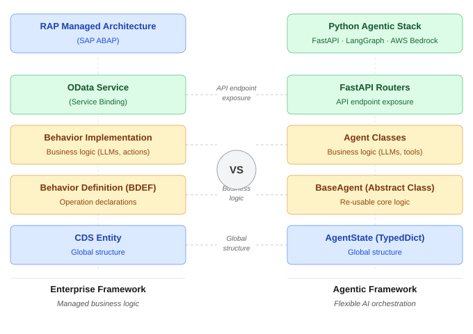

# Order-to-Cash Agentic AI Platform

> **Enterprise-grade, production-ready Agentic AI system** built on AWS — translating 13+ years of financial settlement architecture ($350M+ transaction volumes) into a cloud-native, AI-native platform.


---

## 🔄 Architectural Evolution Path

> **Status: Phase 2 (In-Progress refactoring to E2A alignment)**

This repository operates under an intentional **"Spike-and-Stabilize"** engineering pattern, serving as the primary Python reference validation spike for the [E2A Architecture Framework](https://github.com/subhamviky/e2a-framework).
* **Phase 1 (Stabilized):** Successfully built and verified functional multi-agent coordination boundaries, custom tool endpoints, and infrastructure deployment pipelines.
* **Phase 2 (Active):** Refactoring all standalone nodes and custom orchestration mechanisms to inherit directly from E2A's `BaseAgent` and `BaseWorkflow` abstract class contracts. This proves the transition from procedural agent prototyping to enterprise contract-first software design.

---

## Why This Project Exists

This project applies **the enterprise resilience patterns used in production $350M financial settlement systems** — idempotency, saga compensation, circuit breakers, exactly-once processing, DLQ escalation — directly to an AI-native architecture running on AWS.

**Core mental model:**
```
Agent           = microservice (reasoning unit)
RAG             = CQRS knowledge retrieval layer
MCP Tool        = idempotency-aware API action
Orchestration   = saga-compensating control plane
```
## Core Mental Model — SAP to Agentic

13+ years of SAP enterprise architecture maps **directly** to modern AI-native components. This is not a translation — it is the same pattern set, different runtime.



| SAP RAP / OOP Layer | Python Agentic Component | E2A Shared Paradigm |
| :--- | :--- | :--- |
| **OData Service (Service Binding)** | FastAPI Routers | API endpoint exposure & decoupled ingress boundary. |
| **Behavior Implementation** | Agent Subclasses | Domain business logic and intent execution. |
| **Behavior Definition (BDEF)** | `BaseAgent` (Abstract Class) | Non-Functional Requirement (NFR) contract declarations. |
| **CDS Entity** | `AgentState` (TypedDict) | Graph-wide global shared state structure. |

---

## Architecture

```
┌─────────────────────────────────────────────────┐
│             API Gateway (REST + Auth)            │
└──────────────────────┬──────────────────────────┘
                       │
┌──────────────────────▼──────────────────────────┐
│          ALB  →  ECS Fargate (FastAPI)           │
└──────────────────────┬──────────────────────────┘
                       │
┌──────────────────────▼──────────────────────────┐
│             LangGraph Orchestrator               │
│                                                 │
│  ┌─────────────┐                                │
│  │ RouterAgent │──► ORDER_OPS                   │
│  │  (Haiku)    │──► FINANCE    ──► RAG Retrieval│
│  └─────────────┘──► KNOWLEDGE                   │
│                          │                      │
│                 ┌─────────▼──────────┐          │
│                 │   CriticAgent      │          │
│                 │ (groundedness SLO) │          │
│                 └────────────────────┘          │
└──────────┬────────────────────┬─────────────────┘
           │                    │
┌──────────▼──────┐  ┌──────────▼──────────────┐
│   OpenSearch    │  │    SQS FIFO  +  DLQ      │
│  (RAG / KNN)    │  │   (async workflows)      │
└─────────────────┘  └──────────┬───────────────┘
                                │
                   ┌────────────▼──────────────┐
                   │   Lambda Tool Microservices│
                   │  create_order  check_stock │
                   │  risk_score    open_case   │
                   └───────────────────────────┘
```
> Derived from the **[E2A Framework Specifications](https://github.com/subhamviky/e2a-framework)**

---

## Key Engineering Decisions

| Pattern Element | Cloud-Native & AI Platform Implementation | Enterprise Precedent |
| :--- | :--- | :--- |
| **Idempotency** | DynamoDB two-layer: GSI query + conditional expression | Same pattern as $350M settlement engine mapping to the enterprise Line-Element Key (`REF_ELEM_KEY`). |
| **Saga Compensation** | LangGraph state machine with CriticAgent rollback | Multi-agent automated failure recovery and transactional rollback. |
| **Circuit Breaker** | `pybreaker` per downstream service component | Bedrock, OpenSearch, and tool endpoint failure isolation. |
| **DLQ Escalation** | SQS $\rightarrow$ DLQ after 3 retries + CloudWatch alarm | Zero silent drops; every failure is surfaced to protect error budgets. |
| **Backoff + Jitter** | `tenacity` exponential + random jitter | Thundering herd prevention on high-frequency LLM endpoints. |
| **Model Routing** | RouterAgent $\rightarrow$ Haiku; specialists $\rightarrow$ Sonnet | FinOps: runtime vendor arbitrage optimized per task complexity. |
| **Hybrid RAG** | BM25 + KNN $\rightarrow$ RRF $\rightarrow$ cross-encoder reranker | High-precision retrieval engine providing context-grounded reasoning. |
| **Policy-as-Code** | `governance.yaml` per-agent tool allow/deny matrix | Approval gates, redaction filters, and structural audit trails. |

---

## Tech Stack

| Platform Layer | Technical Selection |
| :--- | :--- |
| **API Server** | FastAPI 0.111 + Uvicorn on AWS ECS Fargate |
| **Agent Orchestration** | LangGraph — 5-agent state machine |
| **LLM Inference** | Amazon Bedrock (Claude 3 Sonnet + Haiku) |
| **RAG Vector Store** | Amazon OpenSearch (KNN + BM25 hybrid indices) |
| **Embeddings** | sentence-transformers / Bedrock Titan |
| **Tool Microservices** | FastAPI + AWS Lambda (Mangum handlers) |
| **Persistence Cache** | Amazon DynamoDB (orders, cases, idempotency, LLM cache) |
| **Async Ingestion** | Amazon SQS FIFO + Dead-Letter Queue (DLQ) |
| **Infrastructure** | Terraform 1.6 on AWS (ap-south-1 deployment) |
| **Observability** | CloudWatch + AWS X-Ray + Distributed OpenTelemetry |
| **CI/CD Pipeline** | GitHub Actions with OIDC Workload Identity Federation |
| **RAG Evaluation** | RAGAS (faithfulness verification gates in delivery pipeline) |

---

## Agents Layout

| Agent | Model | Responsibility | Operational Tools |
| :--- | :--- | :--- | :--- |
| **RouterAgent** | Haiku | Intent classification: `ORDER_OPS` / `FINANCE` / `KNOWLEDGE`. | None |
| **KnowledgeAgent** | Sonnet | RAG-grounded answers with mandatory citation mappings. | OpenSearch retriever tool |
| **OrderOpsAgent** | Sonnet | Order creation, stock availability checks, validations. | `create_order`, `check_stock` |
| **FinanceAgent** | Sonnet | Risk scoring, financial approval gates, policy enforcement. | `risk_score`, `open_case` |
| **CriticAgent** | Haiku | Groundedness scoring (SLO $\ge$ 0.85), dynamic response rewriting. | None |

---

## Service Level Objectives (SLOs)

| Objective Metric | Target SLA | Measured By |
| :--- | :--- | :--- |
| **p95 Workflow Latency** | < 2.5 sec | CloudWatch custom telemetry metric `WorkflowLatencyMs` p95 |
| **Groundedness / Faithfulness** | $\ge$ 0.85 | RAGAS evaluation framework — CI gate blocks deployment pipelines |
| **System Availability** | $\ge$ 99.5% | Application Load Balancer (ALB) 5xx error rate thresholds |
| **Cost per Workflow** | < \$0.03 | Runtime token metadata count $\times$ model price $\rightarrow$ `WorkflowCostUSD` |

---

## Project Status

### Phase 1 — Complete
- [x] FastAPI service layer on AWS Lambda
- [x] Async event processing via SQS with DLQ escalation and exponential backoff
- [x] DynamoDB two-layer idempotency (GSI query + conditional expression)
- [x] CloudWatch structured logging with correlation ID threading

### Phase 2 — In Progress
- [x] LangGraph 5-agent orchestration scaffold
- [x] All agents implemented: Router, Knowledge, OrderOps, Finance, Critic
- [x] Tool microservices: create_order, check_stock, risk_score, open_case
- [ ] Amazon Bedrock RAG pipeline (OpenSearch + RAGAS eval integration)
- [ ] AWS Terraform IaC setup (ECS Fargate, ALB, API Gateway, OpenSearch)
- [ ] GitHub Actions CI/CD with RAG eval gate and automated rollback
- [ ] NFRs: circuit breakers, FinOps model routing, policy-as-code governance

---

## Repository Structure

```
order-to-cash-agentic-ai/
├── agents/           # 5 agents (Router, Knowledge, OrderOps, Finance, Critic)
├── orchestration/    # LangGraph graph, state schema, guardrails, resilience
├── app/              # FastAPI application (routers, middleware, schemas, config)
├── rag/              # Indexer, hybrid retriever, reranker, RAGAS evaluator
├── tools/            # 4 tool microservices + Lambda handlers
├── policies/         # governance.yaml — tool allow/deny, approval gates
├── observability/    # OTel/X-Ray tracer, CloudWatch metrics, SLO checker
├── terraform/        # Full IaC: VPC, ECS, ALB, API GW, SQS, OpenSearch
├── .github/workflows/# CI/CD: test, rag-eval, policy-check, build, deploy
├── tests/            # Unit, integration, RAG evaluation tests
├── data/knowledge/   # Sample O2C knowledge corpus for RAG indexing
└── docker-compose.yml# Local dev: FastAPI + OpenSearch + tool services
```

---

## Local Development

```bash
# Clone and navigate to workspace
git clone [https://github.com/subhamviky/order-to-cash-agentic-ai.git](https://github.com/subhamviky/order-to-cash-agentic-ai.git)
cd order-to-cash-agentic-ai

# Initialize dependencies via Poetry
pip install poetry==1.7.1
poetry install

# Spin up local container nodes
docker-compose up

# Execute primary unit test streams
poetry run pytest tests/unit/ -v
```

---

## Cloud Portability

| AWS | GCP | Purpose |
|-----|-----|---------|
| Lambda / ECS Fargate | Cloud Run | Compute |
| Amazon Bedrock | Vertex AI (Gemini) | LLM inference |
| SQS | Pub/Sub | Async queue |
| DynamoDB | Firestore / Spanner | Persistence |
| OpenSearch | Vertex AI Vector Search | RAG store |
| CloudWatch | Cloud Monitoring | Observability |

LangGraph and MCP tool patterns run identically across AWS, GCP, and Azure.

---

## Related Project

**[aws-reconciliation-engine](https://github.com/subhamviky/aws-reconciliation-engine)** —
Cloud-Native Payment Reconciliation Engine (Phase 1 live on AWS). FastAPI on Lambda, SQS async
processing, DynamoDB two-layer idempotency, CloudWatch observability. Phase 2 adds LangGraph
multi-agent + Bedrock RAG.

---

## Author

**Subham Gupta** — Staff Architect & AI Architect,
13+ years delivering production distributed systems governing $350M+ in annual financial volumes.

[LinkedIn](https://www.linkedin.com/in/subham-gupta-0a05a058) · [Email](mailto:subhamviky@gmail.com)
